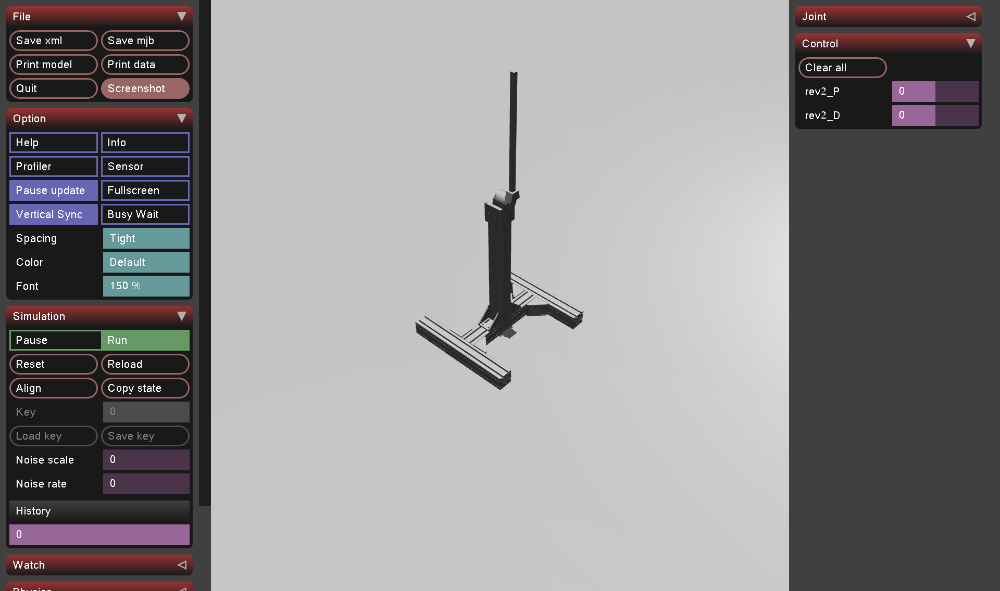

# Robotics Simulation Environments

This repository collects a set of robotic simulation environments and examples built on top of physics engines such as MuJoCo, with plans to expand to other simulators like NVIDIA Isaac Sim and ManiSkill.

---

## 🚀 Overview

- **Current demo**: a simple motor‑test setup in MuJoCo, complete with CAD meshes, URDF/XML definitions, and Python scripts to drive and visualize the model.
- **Future additions**:  
  - **Isaac Sim** scenes and scripts  
  - **ManiSkill** environments and policies  
  - …and more!

---

## 📁 Repository Structure

```
.
├── mujoco
│   ├── models
│   │   └── motor_test
│   │       ├── meshes
│   │       │   ├── base_link.stl
│   │       │   ├── motor_1.stl
│   │       │   ├── shaft_1.stl
│   │       │   └── shaft_holder_1.stl
│   │       ├── MJDATA.TXT
│   │       ├── MJMODEL.TXT
│   │       ├── mjmodel.mjb
│   │       ├── mjmodel.xml
│   │       ├── MUJOCO_LOG.TXT
│   │       ├── scene.xml
│   │       ├── screenshot.png
│   │       ├── test.urdf
│   │       ├── test.xml
│   │       ├── test.py
│   │       └── text.xml
│   └── scripts
│       └── motor_test.py
└── README.md          ← you are here
```

---

## 🛠 Prerequisites

- **MuJoCo 3.x** installed  
- **Python 3.8+**  
- **Python packages**:
  ```bash
  pip install mujoco
  pip install numpy
  # or, for mujoco-py:
  pip install mujoco-py
  ```
---

## ▶️ Running the MuJoCo Motor Test

1. **Launch the example viewer**  
   ```bash
   cd mujoco/models/motor_test
   python test.py
   ```
   This will load `mjmodel.xml` and bring up the MuJoCo GUI. You can toggle playback, sliders, and inspect the meshes in the scene.

2. **Run the scripted test**  
   ```bash
   python ../../../mujoco/scripts/motor_test.py
   ```
   This script programmatically steps the simulation, applies torques, and logs joint angles/forces.

3. **Inspect the scene**  
   Open `scene.xml` in any MuJoCo‑compatible viewer, or inspect the raw XML files (`text.xml`, `test.xml`) to see how assets, bodies, joints, and actuators are defined.

---

## 📷 Preview



---

## ✏️ Contributing & Roadmap

We welcome contributions! In the coming weeks/months, we plan to add:

- **NVIDIA Isaac Sim** examples (URDF → USD pipelines, SDF-based scenes)
- **ManiSkill**‑compatible environments and benchmark agents
- Automated CI tests to validate physics consistency  
- Dockerized demos for zero-install runs

To get started, fork the repo, create a branch, and submit a pull request. Please follow [our contribution guidelines](CONTRIBUTING.md) (coming soon!).

---

## 📄 License

This project is released under the [MIT License](LICENSE).

---

> Built with ❤️ for robotics simulation and research.  
> – General Autonomy 
